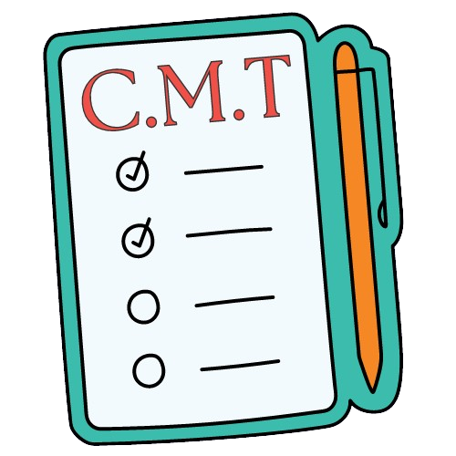

## ✩ [TRY IT NOW](https://0becfad0-d210-4267-beff-f280d3e401a3-00-2gezvzr1ya50k.spock.replit.dev/)

## ✩ ABOUT
A website that focuses on creating a productive atmosphere for the user through its simple, 
aesthetic outlook. By providing the user with fun music and tips that can help them stay on top of their work.

⋆.˚✮ This site also won 3rd place in the beginners divison at the 2020 [Helix Hackathon](https://www.helixhacks.com/#results) ✮˚.⋆

## ✩ KEY FEATURES
An interactive website that includes: a map that showcases the known percentage of cases of COVID-19 both in your city and the world, 
a mini resource page that discusses about the information that users will need to know on how to combat COVID-19, etc.

## ✩ BUILT WITH
- Repl.it
- Canva
- HMTL 
- CSS
- Javascript

